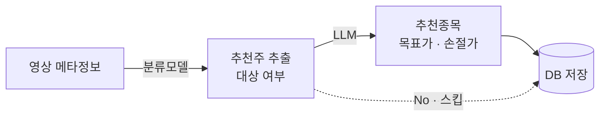

# 추천종목 수집 및 집계
주식 애널리스트나 개인이 유튜브 영상 컨텐츠를 통해 추천하는 종목을 자동으로 수집해 DB에 저장하는 시스템입니다.
 
---
 
## 파이프라인 구조
 

 
### 각 단계 설명
 
| 단계 | 설명 |
|------|------|
| **영상 메타정보** | 유튜브 영상 제목, 설명, 채널명 등 수집 |
| **분류모델** | 해당 영상에 추천주가 있는지 Yes/No 판별 |
| **LLM** | 추천주가 있는 영상에서 구조화된 데이터 추출 |
| **DB 저장** | 추출된 데이터를 DB에 적재 |
 
> 분류모델이 No로 판단한 영상은 LLM 단계를 스킵 → 비용 및 속도 최적화
 
---
 
## 기술 스택 (예정)
 
- 분류모델: TBD
- LLM: TBD
- DB: MariaDB
- 모니터링: TBD (MLflow)